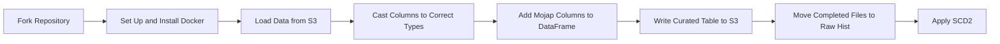

# Data Pipeline Project

This repository demonstrates a data pipeline using Airflow, Python, Docker, and MoJ's own Python modules. The pipeline performs various tasks including loading data from an S3 bucket, casting columns to correct types, adding metadata columns, writing curated tables to S3, and moving completed files to a raw history folder.

## Repository Structure

```gherkin
|-- data
|-- scripts
| |-- utils.py
| |-- functions.py
| |-- config.py
| |-- run.py
|-- tests
|-- requirements.txt
```
## Features

- **Loading Data**: Extract data from a local directory and upload it to an S3 bucket.
- **Data Transformation**: Cast columns to correct types and add metadata columns.
- **Data Storage**: Write curated tables to S3.
- **Data Archiving**: Move completed files to a raw history folder.

## Prerequisites

- Python 3.8 or higher
- Docker

## Installation

1. Clone the repository:
   ```bash
   git clone https://github.com/moj-analytical-services/airflow-de-intro-project-dami
   cd airflow-de-intro-project-dami
   ```

2. Install the required Python packages:
```bash
pip install -r requirements.txt
```

## Configuration

### Environment Variables
The pipeline uses environment variables for configuration. You can set these in a .env file for local development or directly in your DAG environment for production.

Example `.env` file for development (`dev.env`)
```xml
AWS_REGION=your-aws-region
MOJAP_EXTRACTION_TS=your-extraction-timestamp
MOJAP_IMAGE_VERSION=your-image-version
TABLES=your-tables
LANDING_FOLDER=your-landing-folder
RAW_HIST_FOLDER=your-raw-hist-folder
CURATED_FOLDER=your-curated-folder
METADATA_FOLDER=your-metadata-folder
LOG_FOLDER=your-log-folder
DB_NAME=your-db-name
DB_DESCRIPTION=your-db-description
LOCAL_BASE_PATH=your-local-base-path
```

## Running the Pipeline
### Development Environment
To run the pipeline in the development environment, use the following command:

```bash
python scripts/run.py --env dev
```
This will load the settings from the `dev.env` file.

### Production Environment
To run the pipeline in the production environment, use the following command:
```bash
python scripts/run.py
```
This will load the settings from the environment variables.

## Usage
The main script for running the data pipeline is `scripts/run.py`. It supports the following command-line arguments:
- `--env`: Specify the environment (`dev` or `prod`). Default is `prod`.
### Example Usage
```bash
python scripts/run.py --env dev
```

## Logging
Logs are stored in the directory specified by the `LOG_FOLDER` environment variable. The log file is named `data_pipeline.log`.

##  Error Handling
The pipeline includes error handling to log any exceptions that occur during execution. If an error occurs, the pipeline will log the error and exit with a non-zero status code.

## Contributing
Contributions are welcome! Please follow these steps to contribute:
1. Fork the repository.
2. Create a new branch for your feature or bugfix.
3. Commit your changes with a descriptive commit message.
4. Push your changes to your fork.
5. Create a pull request to the main repository.

## License
This project is licensed under the MIT License. See the LICENSE file for details.

## Contact
For any questions or issues, please open an issue on GitHub or contact the DMET.

 This README.md provides a comprehensive overview of your project, including installation instructions, configuration details, usage examples, and contribution guidelines. Feel free to customize it further to better suit your project's needs.



To run this locally, create a `dev.env` file, providing the following parameters:
```yaml
LANDING_FOLDER=<landing_folder> for the raw files
RAW_HIST_FOLDER=<raw_history>
CURATED_FOLDER=<curated_folder>
METADATA_FOLDER=<metadata_folder>
MOJAP_EXTRACTION_TS=1704451200
MOJAP_IMAGE_VERSION='v0.0.1'
TABLES='peoples'
```


```python
python scripts/run.py --env dev
```